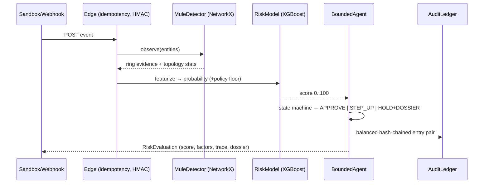

# ARCHITECTURE

Tree below is generated from the actual repository (`git ls-files`) — not hand-authored.

```text
.github/workflows/ci.yml        CI: pytest + next build on every push
app/                            Next.js 14 dashboard (App Router)
  components/
    Navbar.tsx                  brand, track badge, SLA + engine-health pills
    PayloadSandbox.tsx          4 preset payloads, editable JSON, run button
    RiskGauge.tsx               animated score arc + diverging SHAP bars
    AgentTerminal.tsx           typewriter stream of bounded-agent trace
    GraphCanvas.tsx             force-directed SVG entity graph (mules in red)
    DisputeDossierModal.tsx     evidence pack viewer (LLM/template badge)
  layout.tsx / page.tsx / globals.css
backend/
  main.py                       FastAPI app: CORS, middleware, routers,
                                /healthz, /api/v1/{graph,presets,ledger,model-report}
  config.py                     env-driven settings; policy band thresholds
  schemas.py                    Pydantic v2 contracts (event/evaluation/dossier)
  api/v1/
    evaluate.py                 POST /api/v1/risk/evaluate
    webhooks.py                 POST /api/v1/webhooks/razorpay (HMAC verify;
                                honest skip-reason when secret unset; 403 enforce mode)
  core/
    engine.py                   orchestration: graph → featurize → GBDT → floors
                                → attribution → bounded agent → ledger
    audit.py                    append-only hash-chained double-entry ledger;
                                O(1) integrity state + deep rescan
    idempotency.py              pure-ASGI idempotency middleware (Redis/in-proc)
  models/
    risk_model.py               featurize, policy floors, XGBoost wrapper
                                (monotone constraints; single-thread predict);
                                calibrated-linear fallback scorer
    shap_explainer.py           additive attribution aligned to final score;
                                machine reason codes
    report.py                   held-out metrics for GET /api/v1/model/report
  graph/
    mule_detector.py            NetworkX entity graph; ring = fan-out +
                                identity-mass heuristics; Neo4j mirror hook
    embeddings.py               OPTIONAL offline encoder experiment — not in
                                the live path, no live claim depends on it
  agents/
    bounded_responder.py        state machine 0-30/31-70/71-100 → whitelisted actions
    dispute_generator.py        strict-schema dossier (LLM w/ sanitized inputs
                                + deterministic template fallback)
  tests/
    conftest.py                 session TestClient + fixtures
    test_api.py                 endpoints, idempotent replay, webhook signature
                                honesty + enforcement, ledger stats
    test_risk_engine.py         bands, presets, SHAP bounds, tamper evidence,
                                prompt-injection neutralization
    test_graph_generalization.py novel-ring recovery via public API +
                                benign fan-out negative control
data/
  schema.py                     neutral feature-name contract
  ground_truth.py               INDEPENDENT label process (no model imports):
                                interactions, confounder, 6.5% label flips
  generate_synthetic.py         benchmark runner incl. FP-cost-per-1k table
  sample_payloads.json          the four sandbox presets
scripts/
  bench_latency.py              sequential + concurrent latency benchmark
                                (boots its own server; prints conditions)
  train_real_data.py            IEEE-CIS mapping/validation (download-gated)
  serve.py                      local uvicorn launcher used by benchmarks
Dockerfile / docker-compose.yml FastAPI + Redis + Neo4j + Next.js dev stack
```

## Request flow (<50ms target)



## Design invariants

1. **Bounded agent**: action whitelist is exhaustive; no code path moves funds.
2. **Decoupled evaluation**: `data/ground_truth.py` imports nothing from scoring
   modules; reported metrics measure generalization, not self-fulfillment.
3. **Honest degradation**: missing Redis/Neo4j/xgboost/OpenAI degrade features,
   never correctness of what is still claimed.
4. **Tamper evidence**: ledger head verified at boot; appends extend it; deep
   rescan available on demand and in tests.
