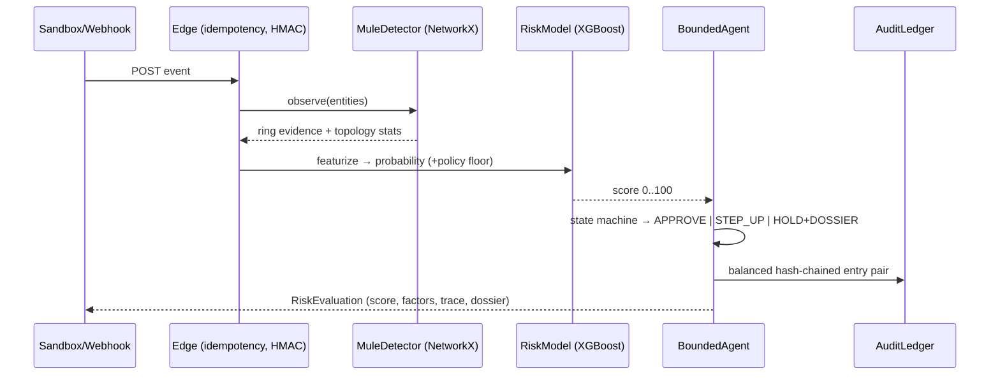

# ARCHITECTURE

Tree below is generated from the actual repository (`git ls-files`) — not hand-authored.

```text
.github/workflows/ci.yml        CI: pytest + next build on every push
frontend/                       Next.js 14 dashboard (App Router) — moved from repo root
  app/
    layout.tsx / page.tsx / dashboard/*   pages + ThemeProvider + LightBar
    globals.css                 design-token system (gold/white/neon-green, grainy black)
    components/
      ui/                      9 bespoke components (LightBar, AvatarList, TextReveal,
                               StreamingText, GoldButton, GoldLoader, GoldInput,
                               GlassForm, LumaDotBackground)
  lib/ hooks/                  API client, theme helper, React Query, live feed
  package.json / next.config.mjs / tailwind.config.ts / tsconfig.json

    PayloadSandbox.tsx          4 preset payloads, editable JSON, run button
    RiskGauge.tsx               animated score arc + diverging SHAP bars
    AgentTerminal.tsx           typewriter stream of bounded-agent trace
    GraphCanvas.tsx             force-directed SVG entity graph (mules in red)
    DisputeDossierModal.tsx     evidence pack viewer (LLM/template badge)
  layout.tsx / page.tsx / globals.css
backend/                       (canonical package now lives under backend/app/)
  app/
    main.py                     create_app() factory: CORS allow-list, security
                                 headers, idempotency + rate-limit middleware,
                                 RFC7807 handler, /healthz, /metrics, routers
    api/v1/
      health.py                 GET /healthz (probes model/ledger/redis/neo4j)
      transactions.py           POST /api/v1/evaluate (+ legacy alias)
      graph.py                  GET /api/v1/graph/topology, POST reset-demo
      ledger.py                 GET /api/v1/ledger/stats
      model.py                  GET /api/v1/model/{report,info}, /api/v1/presets
      webhooks.py               POST /api/v1/webhooks/razorpay (HMAC verify;
                                 honest skip-reason when secret unset; 403 enforce)
    core/
      config.py                 pydantic-settings; ConfigError on bad prod secrets
      security.py               constant-time HMAC + prompt-injection sanitizer
      constants.py              band thresholds, colors, metric names
      idempotency.py            NX+TTL idempotency (Redis or in-proc emulation)
      rate_limit.py             sliding-window per IP + merchant
      metrics.py                Prometheus gauges/histograms/counters
    models/
      schemas.py                Pydantic v2 contracts (event/evaluation/dossier)
      risk_model.py             featurize, policy floors, XGBoost wrapper
      shap_explainer.py         additive attribution; machine reason codes
      report.py                 held-out metrics for /api/v1/model/report
    services/
      scorer.py                 pipeline orchestration + feature-store cache,
                                 PSI drift monitor, cached async SHAP
      graph_detector.py         NetworkX graph; per-partition asyncio.Lock;
                                 LRU eviction; non-blocking Neo4j mirror
      ledger_service.py          append-only hash-chained double-entry ledger
      llm_dossier.py             bounded-agent state machine + dossier generator
    infrastructure/
      redis_client.py / neo4j_client.py / razorpay_client.py  lazy, graceful
  # Deprecated backward-compat shims re-export from backend.app.* (see DECISIONS.md)
  main.py config.py schemas.py core/ graph/ agents/ models/
  tests/
    conftest.py                 session TestClient + fixtures
    test_api.py                 endpoints, idempotent replay, webhook signature
                                honesty + enforcement, ledger stats
    test_risk_engine.py         bands, presets, SHAP bounds, tamper evidence,
                                prompt-injection neutralization
     test_graph_live_api.py deterministic rule firing via live API (not ML
                                 generalization) + benign fan-out negative control
data/
  schema.py                     neutral feature-name contract
  ground_truth.py               INDEPENDENT label process (no model imports):
                                interactions, confounder, 6.5% label flips
  generate_synthetic.py         benchmark runner incl. FP-cost-per-1k table
  sample_payloads.json          the four sandbox presets
scripts/
  bench_latency.py              sequential + concurrent latency benchmark
                                (boots its own server; prints conditions)
  train_real_data.py            IEEE-CIS mapping/validation (download-gated)
  serve.py                      local uvicorn launcher used by benchmarks
Dockerfile / docker-compose.yml FastAPI + Redis + Neo4j + Next.js dev stack
```

## Request flow (<50ms target)



## Design invariants

1. **Bounded agent**: action whitelist is exhaustive; no code path moves funds.
2. **Decoupled evaluation**: `data/ground_truth.py` imports nothing from scoring
   modules; reported metrics measure generalization, not self-fulfillment.
3. **Honest degradation**: missing Redis/Neo4j/xgboost/OpenAI degrade features,
   never correctness of what is still claimed.
4. **Tamper evidence**: ledger head verified at boot; appends extend it; deep
   rescan available on demand and in tests.
