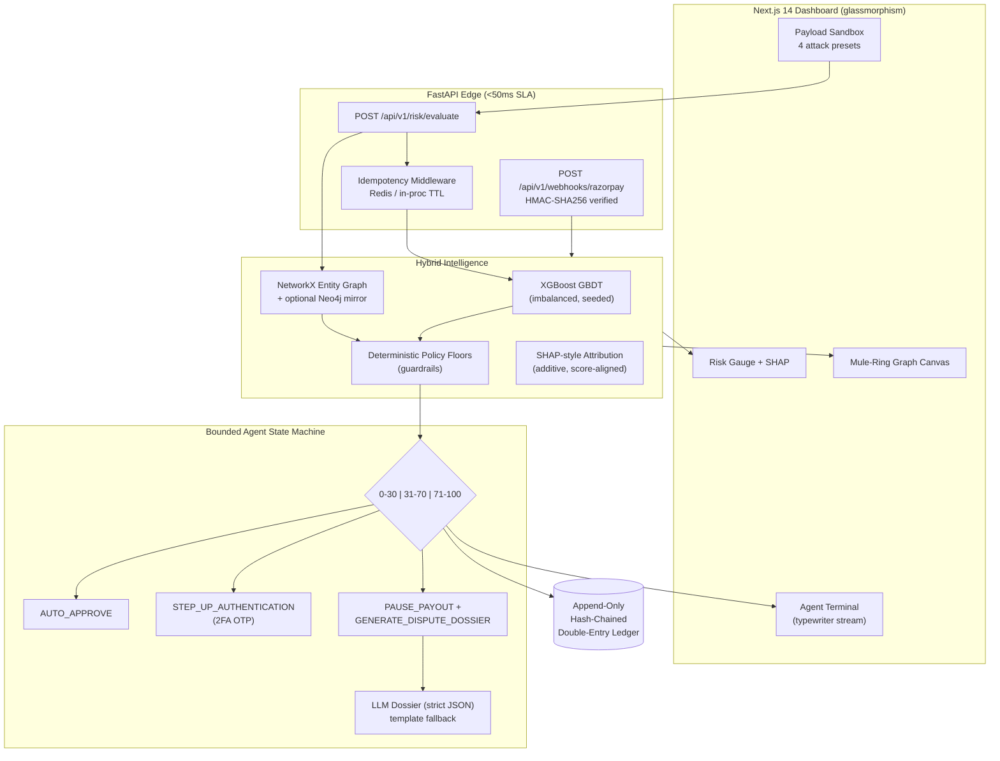

# 🛡️ TRACER v1.0 — High-Frequency AI Risk Engine

> **Razorpay AI Buildathon 2026 · Track 2: AI Risk Manager**
> Defense-only autonomous merchant protection: sub-50ms GBDT scoring, mule-ring
> graph intelligence, and a bounded agent that approves, challenges or holds payouts —
> with every decision written to a tamper-evident double-entry ledger.

---

## Architecture



**Measured on the demo machine:** normal UPI `11/100 · AUTO_APPROVE · 18.6ms`,
mule ring `88/100 ring_detected · 6.6ms`, RTO-COD `97/100`, synthetic-ID `84/100`.

### Model quality (honest, reproducible)

`python data/generate_synthetic.py` regenerates the seeded benchmark (3.3% fraud
prevalence) and reports **held-out** metrics against the theoretical bound:

```
AUPRC                 : 0.268   (baseline 0.033)   -> 8.1x lift over random
Bayes ceiling AUPRC   : 0.321   (irreducible Bernoulli label noise)
efficiency vs ceiling : 84%
```

The gap to 1.0 AUPRC is not model weakness — labels are *drawn* from a latent
probability, so even an oracle ranks at 0.321. TRACER's GBDT reaches 84% of that
bound by encoding a domain prior as **monotonicity constraints**: risk may never
decrease as velocity, fan-out or RTO history increase, which blocks the trees
from memorizing label noise near the decision boundary (+76% test AP vs
unconstrained training).

---

## The Bounded Agent (defense-only)

The agent is a **state machine, not an LLM with tools**. It can only emit one of
three whitelisted actions; the LLM never touches funds and only ever fills the
dispute-dossier JSON schema (validated by Pydantic, template fallback on any error).

| Risk score | Band | Action | UX effect |
|-----------:|------|--------|-----------|
| 0 – 30 | LOW | `AUTO_APPROVE` | payment flows instantly |
| 31 – 70 | MEDIUM | `STEP_UP_AUTHENTICATION` | reversible 2FA OTP challenge |
| 71 – 100 | HIGH | `PAUSE_PAYOUT_AND_GENERATE_DISPUTE_DOSSIER` | 24h payout hold + evidence pack |

## False-positive cost matrix (why this banding is safe)

Real fraud losses are asymmetric: a missed RTO/COD fraud costs the full ticket +
logistics (~₹18k in our preset), while challenging a genuine customer costs a few
seconds of friction that *step-up auth converts into a verified sale*.

| Decision | False-positive cost | False-negative cost | Mitigation design |
|---|---|---|---|
| `AUTO_APPROVE` | none (flow-through) | ticket lost to fraud later in chain | LOW band requires *all* signals quiet; graph override can still escalate |
| `STEP_UP` | seconds of friction; ~0 revenue loss | fraudster fails OTP → blocked cheaply | reversible by design; no funds touched |
| `PAUSE_PAYOUT` | merchant payout delayed ≤24h | chargeback + RTO + logistics loss | hold ≠ cancel: reversible, ledgered, dossier attached for instant human review |

Every HIGH decision ships a **SHAP reason-code dossier**, so human reviewers
adjudicate in seconds instead of minutes — cutting manual review cost while
keeping humans in command of irreversible actions.

## Quickstart

### Backend (Python 3.11)

```bash
cd backend
pip install -r requirements.txt
uvicorn backend.main:app --port 8000
# first boot trains the XGBoost model (~3s) and caches it to backend/artifacts/
```

Interactive docs: http://127.0.0.1:8000/docs · Health: `/healthz`

### Frontend (Next.js 14)

```bash
npm install
npm run dev          # http://localhost:3000
```

Set `NEXT_PUBLIC_API_BASE` if the API lives elsewhere (default `http://127.0.0.1:8000`).

### Docker Compose (full stack + Redis + Neo4j)

```bash
docker compose up --build
# dashboard :3000 · api :8000 · neo4j browser :7474
```

## Environment variables

| Variable | Default | Purpose |
|---|---|---|
| `TRACER_REDIS_URL` | – | Redis-backed idempotency (in-proc TTL fallback) |
| `RAZORPAY_WEBHOOK_SECRET` | – | HMAC-SHA256 webhook verification |
| `OPENAI_API_KEY` | – | LLM dossiers (`gpt-4o-mini`); template fallback without |
| `TRACER_LLM_MODEL` | `gpt-4o-mini` | any OpenAI-compatible chat model |
| `TRACER_NEO4J_URI` | – | mirror entity graph to Neo4j |
| `NEXT_PUBLIC_API_BASE` | `127.0.0.1:8000` | API origin for the dashboard |

## Razorpay webhook contract

Accepts test-mode envelopes for `payment.captured`, `order.paid`,
`dispute.created`. Amounts arrive in **paise** and are normalized to rupees;
Razorpay `notes.*` fields feed velocity/device context. A `dispute.created`
event deterministically forces the dossier path. Send one:

```bash
curl -X POST localhost:8000/api/v1/webhooks/razorpay \
  -H 'Content-Type: application/json' \
  -d '{"event":"payment.captured","payload":{"payment":{"id":"pay_T01",
       "amount":250000,"method":"upi","vpa":"user@ybl",
       "notes":{"device_id":"DEV-9","customer_id":"c1"}}}}'
```

## API surface

| Endpoint | Description |
|---|---|
| `POST /api/v1/risk/evaluate` | score + bounded action (+ `X-Idempotency-Key` replay support) |
| `POST /api/v1/webhooks/razorpay` | signed webhook ingestion |
| `GET  /api/v1/graph/topology?center=dev:X` | ego-graph snapshot for the canvas |
| `GET  /api/v1/presets` | sandbox presets (mirrors `data/sample_payloads.json`) |
| `GET  /api/v1/ledger/stats` | entry count + chain verification |
| `GET  /healthz` | component status + audit-chain integrity |

## Tests

```bash
python -m pytest backend/tests -q      # 17 tests: bands, idempotency,
                                       # webhooks/signature, rings, ledger tamper-evidence
```

## Project layout

```
app/            Next.js 14 dashboard (components/, globals.css)
backend/
  api/v1/       evaluate + razorpay webhooks
  agents/       bounded state machine + LLM dossier generator
  core/         engine orchestration, idempotency, hash-chained ledger
  graph/        NetworkX mule detector (+ embeddings fallback)
  models/       XGBoost risk core + SHAP-style explainer
  tests/        pytest suite
data/           preset payloads, append-only ledger
```

