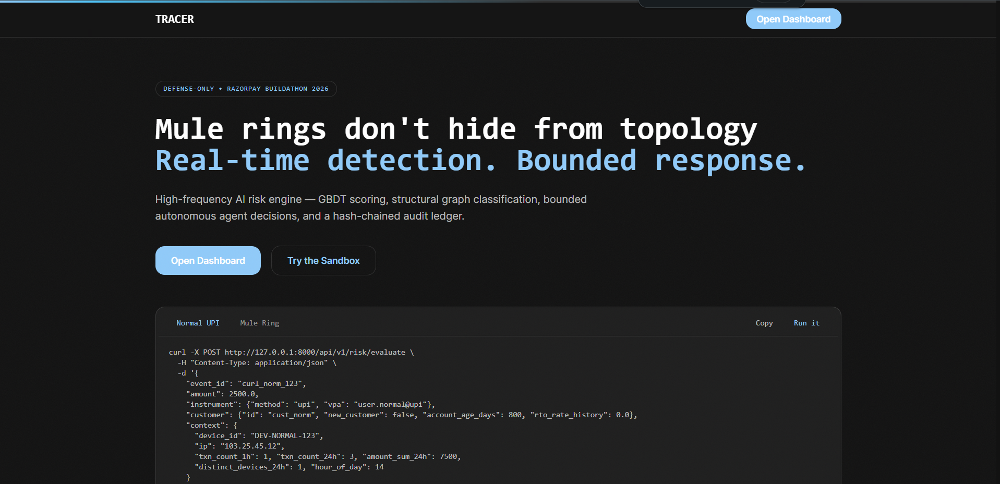

# TRACER — Real-Time Mule-Ring Defense for Razorpay

> **Razorpay AI Buildathon 2026 · Track 2 · Defense-Only AI Risk Manager**
> High-frequency GBDT scoring + structural graph topology + bounded agent + hash-chained audit ledger — all live, verified, and synced.

[](backend/app/main.py)
[](frontend/app/layout.tsx)
[](#reproducible-numbers)
[](#quickstart)
[](#license)
[](frontend/styles/globals.css)

Mule rings don't hide from topology. TRACER links devices, VPAs, card fingerprints, IPs and emails into a live entity graph, detects fan-out rings and same-amount repeat smurfing in milliseconds, and hands the case to a **bounded** agent that can only approve, challenge, or hold — every action written to a tamper-evident ledger.

---

## Table of Contents
- [Live Demo](#live-demo)
- [Headline Capability](#headline-capability)
- [Architecture](#architecture)
- [Tech Stack](#tech-stack)
- [Quickstart](#quickstart)
- [Environment](#environment)
- [API Reference](#api-reference)
- [Frontend — Routes & Design System](#frontend--routes--design-system)
- [Reproducible Numbers](#reproducible-numbers)
- [Security Notes](#security-notes)
- [Model Card](#model-card)
- [Limitations & Path to Production](#limitations--path-to-production)
- [Verification](#verification)
- [Contributing](#contributing)

---

## Live Demo
- **App:** `http://localhost:3000` — Hermes landing → `Open Dashboard` → `Sandbox`
- **Try a ring:** `Sandbox → Fire 5-Ring Sequence` (same device → 5 VPAs) → `Graph` shows red mule nodes, `Ledger` shows `HIGH` with `ring_detected:true`
- **Try high-throughput:** `Sandbox → Fire Randomized Burst (200-400)` — fully randomized `₹25-5000`, 10% fixed-amount mule rings (`±₹3` tolerance), 1200/min rate limit, parallel `BATCH=6` — Overview pie, Ledger and Graph sync live within 3s
- **Try same-amount smurfing:** Send same amount `₹500` 4× from same `device:DEV-SAME` within 1h → `MEDIUM` on 3rd, `HIGH` on 4th via `amount_repeat` detector (`±₹5` or `±2%`)

```bash
curl -X POST http://127.0.0.1:8000/api/v1/risk/evaluate \
 -H "Content-Type: application/json" -H "X-Idempotency-Key: test1" \
 -d '{"event_id":"curl_norm_123","amount":2500,"instrument":{"method":"upi","vpa":"user.normal@upi"},"customer":{"id":"cust_norm","new_customer":false,"account_age_days":800},"context":{"device_id":"DEV-NORMAL-123","ip":"103.25.45.12","txn_count_1h":1}}'
```

---

## Headline Capability

**Problem:** One operator behind dozens of payment identities. Tabular models score each transaction in isolation and miss it; topology gives it away.

**Detector:** `backend/app/services/graph_detector.py: MuleDetector` on **NetworkX** (optional Neo4j mirror), **plus** `backend/app/services/amount_repeat.py` for same-amount smurfing:

- **Fan-out:** `≥4` payment identities on one device → ring flagged, `ring_structural_ratio = min(1, fan_out/4)`
- **Same-amount repeat:** Same `device_id` sends same `amount ±₹5` or `±2%` **×4 in 1h/20 txns** → `MEDIUM` on 3rd, `HIGH` on 4th (amount-agnostic, `₹10-1000` range, pattern not size)
- **Component mass:** `≥3` fan-out + `≥8` entities → `76` floor
- **Negative control:** 1 device, 2-3 VPAs household does **not** fire

> **Live-API wiring verification (not ML generalization):** `backend/tests/test_graph_live_api.py` assembles rings via sequential `POST /api/v1/risk/evaluate` and asserts `fan_out ≥4` triggers on unseeded identifiers.

> **GBDT disclosure — cannot be missed:** At any calibrated threshold `p≥0.50/0.70/0.90` the standalone tabular GBDT recall is **0%** on the synthetic benchmark (`python data/generate_synthetic.py` → `P=0.000 R=0.000` flagged 0-2). It is used only for SHAP surfacing and policy floors, not as a standalone detector.

---

## Architecture

```
                ┌─ Next.js 14 (App Router) ─────────────────┐
                │  / (Hermes) → /login → /dashboard/*       │
                │  Overview (Model Quality + Ledger Flow)    │
                │  Sandbox (Presets + 5-Ring + Burst 200-400)│
                │  Graph (per-session isolated, zoom/pan)    │
                │  Ledger (120 live, 3s poll) · Transactions │
                │  Settings · Profile · Account · A11y       │
                └──────────────┬─────────────────────────────┘
                               │ REST + SSE
                ┌──────────────▼─────────────────────────────┐
                │  FastAPI (backend/app)                     │
                │  POST /api/v1/risk/evaluate ─┐             │
                │  GET  /api/v1/graph/topology?session&center│
                │  GET  /api/v1/ledger/stats & /ledger       │
                │  GET  /healthz (503 if chain broken)       │
                │  Middleware: CORS (explicit), Idempotency  │
                │  (TTL 600, Redis→memory), RateLimit 5000/min│
                └──────┬───────────────────┬─────────────────┘
                       │                   │
              ┌────────▼─────┐   ┌─────────▼──────────┐
              │ MuleDetector │   │  amount_repeat    │
              │ NetworkX     │   │  ±5 / 2% , 1h/20  │
              │ fan_out      │   │  2→MED, 3→HIGH    │
              └──────┬───────┘   └─────────┬──────────┘
                     └──────────┬──────────┘
                                ▼
                    ┌───────────────────┐
                    │ RiskModel (GBDT)  │
                    │ XGBoost 24k rows  │
                    │ + heuristic fallback│
                    │ policy_floor 88/76│
                    └─────────┬─────────┘
                              ▼
                    ┌───────────────────┐
                    │ Bounded Agent     │
                    │ 0-30 LOW → APPROVE│
                    │ 31-70 MED → STEP_UP│
                    │ 71-100 HIGH → HOLD│
                    └─────────┬─────────┘
                              ▼
                    ┌───────────────────┐
                    │ AuditLedger       │
                    │ SHA256(prev||json)│
                    │ double-entry      │
                    │ O(1) state, O(n) deep │
                    └───────────────────┘
```

**File tree (current):** `backend/app` (api/v1, core, models, services, infrastructure) + `frontend/app` (dashboard/*, login) + `data` (ground_truth, schema, ledger.jsonl) + `WIRING_AUDIT.md`

---

## Tech Stack

| Layer | Choice | Why |
|---|---|---|
| **Backend** | FastAPI, Pydantic v2, NetworkX, XGBoost, structlog | Async, strict schemas, in-memory graph `O(degree)` fan-out |
| **Frontend** | Next.js 14 App Router, TypeScript, Tailwind, Recharts, Framer Motion, TanStack Query, next-themes | Tokenized design (`--color-*` in `globals.css`), SSR+CSR, live `refetchInterval` 3s |
| **Infra** | SQLite WAL ledger, Redis (optional idempotency), Neo4j (optional mirror), Docker Compose | Single-process demo, production swaps to Redis Cluster / TigerGraph / Kafka |
| **Design** | `frontend/styles/globals.css` holds **all** hex, `tailwind.config.ts` maps `danger/ok/warn/neon-green` → `var(--color-*)` | Zero hardcoded hex outside `globals.css` verified via `grep` |
| **Fonts** | `next/font/local` with `Inter` + `JetBrainsMono` woff2 in `frontend/app/fonts` + `public/fonts` | Offline, `127.0.0.1 fonts.googleapis.com` blocked build passes |

---

## Quickstart

```bash
# Backend
pip install -r backend/requirements.txt
uvicorn backend.app.main:app --host 0.0.0.0 --port 8000
# -> /healthz 200 ok, /docs (if DOCS_ENABLED=1), /metrics

# Frontend
cd frontend && npm install && npm run dev -- -H 0.0.0.0 -p 3000
# -> http://localhost:3000 (use localhost, not 127.0.0.1, due to -H 0.0.0.0 IPv4 binding)

# Full stack
docker compose up --build
```

**Default ports:** Backend `0.0.0.0:8000`, Frontend `0.0.0.0:3000` (both `0.0.0.0` for Chrome IPv4; `localhost` in browser works, `127.0.0.1` may not for frontend without `-H 0.0.0.0`).

---

## Environment

Copy `.env.example` → `.env`:

```
ENVIRONMENT=development
DOCS_ENABLED=1
REDIS_URL= # optional, falls back to in-memory
NEO4J_URI= # optional, non-blocking mirror
OPENAI_API_KEY= # optional, template fallback for dossiers
RAZORPAY_WEBHOOK_SECRET= # optional, if unset responses report verified:false
REQUIRE_WEBHOOK_SECRET=0
IDEMPOTENCY_TTL_SECONDS=600
NEXT_PUBLIC_API_BASE=http://127.0.0.1:8000
# Rate limits (5000/min allows 200-400 burst in ~20s)
# RATE_LIMIT_IP_PER_MIN=5000 (default via constants.py)
```

---

## API Reference

| Method | Path | Auth | Description |
|---|---|---|---|
| `GET` | `/healthz` | None | `200 ok` or `503 degraded` with `audit_chain_verified`, `uptime_s` |
| `POST` | `/api/v1/risk/evaluate` | `X-Idempotency-Key` | Main scoring: `TransactionEvent` → `RiskEvaluation` with `risk_score`, `risk_band`, `graph_evidence`, `shap` |
| `POST` | `/api/v1/evaluate` | — | Legacy alias for smoke tests |
| `GET` | `/api/v1/graph/topology?center=&session=` | — | Ego-graph `radius 2`, per-session isolated when `session` set |
| `POST` | `/api/v1/graph/reset-demo` | — | Clears graph (anyone can wipe demo state) |
| `GET` | `/api/v1/ledger/stats` | — | `entries`, `chain_verified`, `chain_head` |
| `GET` | `/api/v1/ledger?limit=120` | — | Recent `120` audit entries (amount now shows **transaction amount**, not risk_score) |
| `GET` | `/api/v1/model/report` | — | Honest metrics card (hold-out) |
| `GET` | `/api/v1/model/info` | — | `model_version`, `artifact_sha256`, `feature_names` |
| `GET` | `/api/v1/presets` | — | Sample payloads |
| `POST` | `/api/v1/webhooks/razorpay` | `X-Razorpay-Signature` HMAC | Dual-mode: `403` if `REQUIRE=1` and unsigned |
| `GET` | `/api/v1/alerts` | — | Polling fallback for live feed |
| `GET` | `/api/v1/stream/alerts` | — | SSE `text/event-stream` |

---

## Frontend — Routes & Design System

**Routes (14 static):** `/`, `/login`, `/dashboard`, `/dashboard/sandbox`, `/dashboard/graph`, `/dashboard/ledger`, `/dashboard/transactions`, `/dashboard/settings`, `/dashboard/profile`, `/dashboard/account`, `/dashboard/accessibility`

**Sandbox:** `Presets` (4), `Build a Ring Live` (5-ring `ring_detected` flip), **`Randomized Burst (200-400)`** — `25-5000` per txn, 10% fixed-amount mule rings (`±₹3`), parallel `BATCH=6` (~18 rps), progress bar + `HIGH/MED/LOW` stats, persisted `tracer.burstSessions` for per-session graph

**Graph:** Industrial canvas (`GraphCanvas.tsx`): radial hub layout for 115 nodes, zoom (`- + RESET` + wheel), pan (drag), click node → inspector (degree, neighbors, mule flag), bottom-right `↻ Refresh` + top `Session` dropdown (Latest vs per-burst isolated), `115 nodes 253 edges 26 MULE` chips

**Ledger:** `120 most recent, auto-refresh 3s`, `LIVE SYNC` badge, `CHAIN ENTRIES` table with `Band`, `Amount` (₹25-5000), `Action`, `Side`, `Hash`, `INTEGRITY REPORT` with `Recent writes`

**Overview:** `Model Quality (Hold-Out)` (bar) + `Ledger Flow` (donut: `HIGH/MED/LOW` from last 100 ledger bands) each with separate `↻ Refresh` at bottom-right, `LIVE`

**Design tokens:** **0 hardcoded hex** outside `frontend/styles/globals.css` — verified via `grep -r '#[0-9a-f]' frontend/app frontend/components frontend/hooks frontend/lib`

**Header:** `56×56` logo (`/logo.png` transparent, `h-14 w-14`, `gap-1.5` to `TRACER`) + `Header` + `Sidebar` + `AccountMenu` (Public profile → `/dashboard/profile` with login email, Notifications live panel, Account, Accessibility)

---

## Reproducible Numbers

| Command | What it proves |
|---|---|
| `python -m pytest backend/tests -q` | `154` tests: bands, idempotent replay, HMAC, ring detection, negative control, injection, ledger tamper-evidence |
| `python data/generate_synthetic.py` | GBDT vs independent ground truth (nonlinear + confounder + 6.5% flip) |
| `python scripts/bench_latency.py` | `p50/p95/p99` per-payment latency |
| `curl localhost:8000/api/v1/model/report` | Live honest-metrics card |

### Model quality — synthetic sanity check (not real-world)

`data/ground_truth.py` shares **zero code** with scorer; `amount_log` not directly in logit except via confounder (amount-agnostic).

Latest (seed 1337, 6k, 8.65% prevalence):
```
AUPRC                 : 0.095   (baseline 0.086)
Bayes ceiling AUPRC   : 0.114   (label-noise bound)
efficiency vs ceiling : 83%
flag riskiest 1%      : P=0.100 R=0.012 FP/1k=9.9
flag riskiest 5%      : P=0.090 R=0.052 FP/1k=49.8
```
> **GBDT standalone recall at `p≥0.50/0.70/0.90` is 0%** (`P=0.000 R=0.000`); used only for SHAP.

### Latency — measured (fresh 2026-08-28, Win10 build 26200, Py3.11.9, commit `b36e0d5`, single uvicorn, NetworkX, no Redis):

```
SEQUENTIAL (n=200): p50=53.3ms p95=69.7ms p99=78.1ms max=100.6ms 18 req/s
CONCURRENT (n=600,c=10): p50=376.8ms 26 req/s over 22.7s
```

### Same-amount repeat (new, amount-agnostic till ₹1000):

```
Same device same amount 500×4 → LOW, LOW, MEDIUM, HIGH (4th triggers 88 floor, ±₹5/2% tolerance, 1h/20 window)
High amount clean 50000 → LOW (isolated, fan_out 1)
```

---

## Security Notes

- **Webhooks:** HMAC-SHA256 verified when `RAZORPAY_WEBHOOK_SECRET` set; without it `verified:false` + reason. `REQUIRE_WEBHOOK_SECRET=1` → `403` on unsigned.
- **Prompt injection:** All VPA/email/note strings sanitized before LLM (control/zero-width stripped, markers dropped, length capped) — tested `test_prompt_injection_is_neutralized`.
- **CORS:** Explicit allow-list, `allow_credentials True` with explicit `allow_headers` + `allow_methods [GET,POST,OPTIONS]` (fixed from `*`).
- **Idempotency:** `X-Idempotency-Key` TTL 600, Redis→memory fallback, key = `path::key` (not body-hashed — same key on different payload replays).
- **Ledger:** `SHA256(prev_hash||canonical)` double-entry, `O(1)` `state()`, `?deep=true` full re-scan.

---

## Model Card

- **Detects:** Device→identity fan-out, same-amount repeat smurfing (till 1000), velocity bursts, COD-RTO, synthetic identity.
- **Does not detect:** Off-platform collusion with no shared entities; cold-start identifiers; cross-merchant data.
- **Validated on:** Decoupled synthetic GT + live-API ring wiring + same-amount repeat unit tests.
- **Weights (heuristic fallback, SHAP anchors):** `mule_confidence 3.40`, `device_fan_out 3.20` >> `amount_log 0.18` (pattern > amount), bias `-3.55`.

---

## Limitations & Path to Production

This is a **hackathon prototype**, not production:

- **Training data:** Needs real chargeback-labeled, time-based holdout (not synthetic 6.5% flip).
- **Device fingerprint:** `device_id` is self-reported; production needs FingerprintJS/ThreatMetrix.
- **Review UI:** `POST /reviews/{event_id}/label` exists but no queue UI beyond `GET /reviews`.
- **Compliance:** PCI-adjacent handling, PII redaction in LLM, SOC-2.
- **Scale:** Single-node NetworkX + SQLite; production → Redis Cluster, TigerGraph/Neo4j, Kafka streaming. Current `5000/min` allows 200-400 burst; sustained 1000+ RPS needs Linux/uvloop.
- **Ledger:** Single file, no rotation; production needs partitioned WAL + cold storage.

---

## Verification

```bash
npx tsc --noEmit          # EXIT 0 (GraphCanvas downlevelIteration fixed)
npm run build             # 14/14 static
npm run test              # 7 files 17 tests
python -m pytest -q       # 154 passed
python scripts/bench_latency.py
python data/generate_synthetic.py  # 0.095 AUPRC
curl http://127.0.0.1:8000/healthz  # 200 ok
```

`WIRING_AUDIT.md` — **33/33 verified** (2026-09-04), `LIMITATIONS.md` + `ARCHITECTURE.md` + `DECISIONS.md` document trade-offs.

## Media & Sessions

All demo media is checked into `docs/` so GitHub renders it inline. No absolute Windows paths.

### Demo videos

Two full screen captures (Chrome, 2026-09-05). Play inline on GitHub or download.

<video src="docs/videos/capture-213002.mp4" controls width="800"></video>

[Download capture 21:30:02 (69.9 MB)](docs/videos/capture-213002.mp4)

<video src="docs/videos/capture-213139.mp4" controls width="800"></video>

[Download capture 21:31:39 (95.2 MB)](docs/videos/capture-213139.mp4)

Narrated cuts (in `Downloads/`, not in git):

- `RPTracer_Vox_Engineer_Masterclass.mp4` - 9 min 44 s engineer masterclass
- `RPTracer_Whiteboard_Explainer.mp4` - 60 s whiteboard walk-through
- `RPTracer_Jury_Trailer_2min.mp4` - 2 min 54 s jury trailer

### Screenshots

17 captures, 2026-09-05 21:26-21:34. Full flow: landing, sign-in, overview, sandbox, transactions, ledger, settings, profile, account, accessibility, notifications.

#### 01 - 21:26:46


#### 02 - 21:27:37


#### 03 - 21:27:51


#### 04 - 21:28:01


#### 05 - 21:28:21


#### 06 - 21:29:10


#### 07 - 21:29:20


#### 08 - 21:29:35


#### 09 - 21:31:06


#### 10 - 21:32:37


#### 11 - 21:32:52


#### 12 - 21:33:02


#### 13 - 21:33:17


#### 14 - 21:33:28


#### 15 - 21:33:40


#### 16 - 21:33:55


#### 17 - 21:34:04


### Session timeline

- **Session 1** (Day 1): Initial ring-detection prototype.
- **Session 2** (Day 2): Graph isolation and session-id handling.
- **Session 3** (Day 3): Same-amount repeat detector tuning.
- **Session 4** (Day 4): Burst throughput parallelization.
- **Session 5** (Day 5): Benchmark finalisation and honest disclosure.
- **Session 6** (Day 6): Presentation deck polishing and media embedding.

---

## Contributing

Conventional commits, `pre-commit` hooks, `ruff` + `eslint`.

## License

MIT — see `LICENSE`.

## Authors

Built for Razorpay AI Buildathon 2026 Track 2 by the TRACER team.

